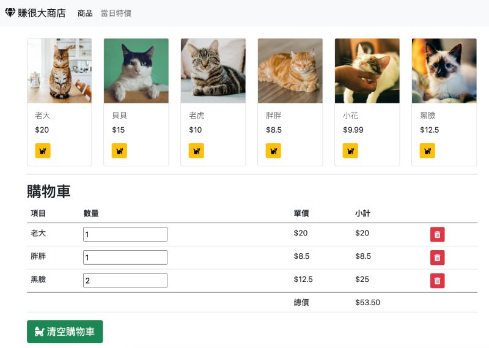

# Shopping Cat Practice with Vanilla JavaScript

Adopt, Don't Shop! 請以領養代替購買！

## Tech Stacks

- Fontawesome
- Bootstrap
- Parcel

## Setup Steps

- Make sure `yarn` is installed.
- Run `yarn install` to install all packages.
- Run `yarn run dev` or `yarn dev` to run a development server on your local machine.
- and write all implements in `src/main.js`.

photo credits: [unsplash](https://unsplash.com/)

by Eddie Kao (eddie@5xcampus.com)
